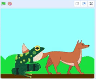

Mae dwy ffordd i leoli dy gorluniau mewn haenau.

Galli di lusgo corlun ar i'r Llwyfan i'w symud i'r haen flaen:

{:width="300px"}

Neu, galli di ddefnyddio bloc `mynd i haen blaen`{:class="block3looks"} neu `mynd i haen cefn`{:class="block3looks"} i leoli corlun.

Os wyt ti am i gorlun aros yn y `blaen`{:class="block3looks"} neu'r `cefn`{:class="block3looks"} bob amser, defnyddia ddolen `am byth`{:class="block3control"} i wneud i'r corlun symud yn ôl i'r haen gywir os byddi di'n ei symud yn ddamweiniol:

```blocks3
when flag clicked
forever
go to [front v] layer // neu gefn
```
