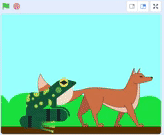

Υπάρχουν δύο τρόποι για να τοποθετήσεις τα αντικείμενά σου σε επίπεδα.

Μπορείς να σύρεις ένα αντικείμενο στη Σκηνή για να το μετακινήσεις στο προσκήνιο:

{:width="300px"}

Εναλλακτικά, μπορείς να χρησιμοποιήσεις ένα μπλοκ `πήγαινε σε επίπεδο προσκήνιο`{: class = "block3looks"} ή `πήγαινε σε επίπεδο υπόβαθρο`{: class = "block3looks"} για να τοποθετήσεις ένα αντικείμενο.

Αν θέλεις ένα αντικείμενο να παραμένει πάντα στο `προσκήνιο`{: class = "block3looks"} ή στο `υπόβαθρο`{: class = "block3looks"}, χρησιμοποίησε έναν βρόχο `για πάντα`{: class = "block3control"} για να κάνεις το αντικείμενο να επιστρέφει στο σωστό επίπεδο εάν το μετακινήσεις κατά λάθος:

```blocks3
when flag clicked
forever
go to [front v] layer // or back
```
