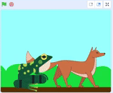

Є два способи розміщення спрайтів на плані.

Ти можеш перетягнути спрайт на Сцену, щоб перемістити його на передній план:

{:width="300px"}

Крім того, ти можеш скористатися блоком `помістити на передній план`{:class="block3looks"} або блоком `помістити на задній план`{:class="block3looks"}, щоб визначити позицію спрайта.

Якщо ти хочеш, щоб спрайт завжди залишався на `передньому`{:class="block3looks"} або `задньому`{:class="block3looks"} плані, використовуй цикл `завжди`{:class="block3control"}, щоб змусити спрайт повернутися на правильний план, якщо ти випадково його перемістив:

```blocks3
when flag clicked
forever
go to [front v] layer // or back
```
